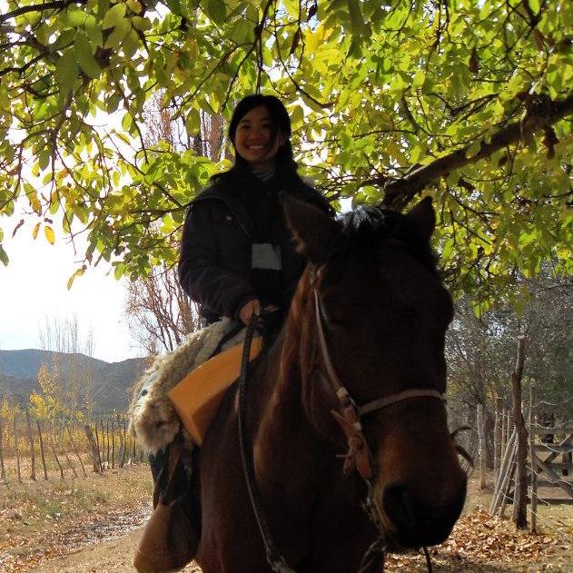

**In 2011, I decided to learn Spanish.** I took two Introductory Spanish college courses. Each course ran for 50 minutes, three times a week, over a span of 16 weeks. Each week, we were assigned generous amounts of long, tedious homework, which would take an average of about three hours to complete. We had to read chapters in the textbook, memorize vocabulary words, and do written and verbal exercises on the computer. By the time I had completed my second class, I had a total of about 75 hours of direct classroom Spanish instruction, and about 60 hours of self directed Spanish study at home. With a total of 135 hours of Spanish learning behind me, at this point I was feeling pretty confident, or *bastante seguros*, with my Spanish language skills.

**In 2012, I decided to go to Mendoza, Argentina for six weeks to finish my Spanish studies.** As soon as I landed, I was greeted by my Argentinian host family, and a flurry of rapid Spanish began around me. I was at a complete loss for words. Up until this point, I could only barely understand my patient and simple-speaking Spanish professor and the slow, exaggeratedly enunciated voices of my online Spanish workbook. I managed "hola" and "si" and that was about it. Suddenly all the Spanish I had drilled into my brain over the past nine months was failing me.

At my host house, I had a host mother, a host mother's boyfriend, three host sisters, three host sisters' boyfriends, and a host dog. None of them spoke any English. I hated myself for my ineptitude and felt profoundly stupid as my host mother would wake me up in the morning and urgently ask me questions in Spanish as she hurriedly made me breakfast and made sure I caught the right bus to the local University. Something I thought I had been exceptionally prepared for ended up making me feel like I was back at square one, sitting in my first Spanish class all over again.

The first two weeks were a constant mental and physical workout. My mind was constantly attempting to comprehend what was going on around me, translate things back into English, and when I didn't know enough Spanish, I'd have to use context clues to infer what things or people meant. I used a lot of pictures, gestures, and broken sentences, but eventually, I came up with a system, and I learned how to get around. I was able to pick up on certain key words and phrases. My vocabulary slowly began to expand. Verbs were becoming easier to conjugate. And I became more comfortable speaking in Spanish to others.

But I wasn't spending my nights reading my textbook or memorizing words like I did before. Instead, I was going out to pubs, going horseback riding in the Andes mountains, learning how to ski at Las Lenas, wine tasting at famous Mendoza malbec wineries, getting lost in the Mendoza ghetto, and taking tango dancing classes. At one point I thought to myself, *I really should start studying more if I really want to improve my Spanish.*

**During the last week of my stay in Mendoza, two amazing things happened.** First of all, I had my first dream in Spanish. Second of all, I was able to give an impromptu 20 minute presentation completely in Spanish. I was not nervous, and it came out almost naturally, as if it was of second nature. 

  
  
  
  

### On Language Learning

I learned a lot of important things from my study abroad in Mendoza. Obviously, I learned about Argentinian culture and the Spanish language. I learned that Mendoza empanadas are superiorly delicious, Argentinians are great story tellers, and that in Argentina, dinner is served at 10 PM and nightlife begins around 2 PM. However, I also learned something about learning itself. I realized that I had learned exponentially more Spanish in six weeks in Argentina than I did in nine months in my college class. Being in Mendoza was definitely more challenging and more physically and mentally demanding than course learning, but the payoff was so much greater. I became immersed in the language. I was forced to understand the language. It was so much more than just grammar, vocabulary words, verb conjugations, syntax, and sentence structure. There was culture, there was tone, and there was intent. Simply having intentions behind the words I was speaking and comprehending made the experience so much more rewarding. I wasn't just making up a scenario for a five minute class presentation, and I wasn't just listening to some prerecorded man speak about some dull subject. I was using Spanish the way I wanted to, and because of that, I was able to learn so much more. 

When I returned from Mendoza, I decided I was done with my Spanish education. Instead, I dedicated the next few years to learning many other languages—programming languages. I learned Java, C, C++, Lisp, Ruby, Prolog, and many more. And I plan on continuing to learn more languages in the future (both spoken and programming languages). Every time I learn a new language now, I remind myself of my experience in Mendoza. There are many different ways to learn a language. But undoubtedly the best way is to simply dive in blindly, get confused, set some goals, and force yourself to learn along the way. You cannot become proficient at a language simply by reading about it, learning the syntax, reading the API, and reading a few precoded snippets. You may think you fully understand the language after this, but I've come to realize that this is rarely the case. Languages are learned by doing, creating, and becoming immersed in them. The more you do hands on language learning—such as coding—the more you will learn. This is what I believe.

### Application 

During the summer of 2015 I was the TA for an online Secure Coding class. I was given the lesson plans and material used in the previous classes, but I was also told that I was allowed to change the structure of the class any way I wanted, with the professor's approval. The previous lesson plans were very reading and response heavy, with one main project at the end. To me, this structure seemed similar to how I learned Spanish—I learned it all from the book, and then I had a huge project at the end, and I became overwhelmed and found it difficult to figure out how to properly use the knowledge that I had acquired. Instead, I imagined a class structure that forced the students to program and use the ideas they were reading about from the start of the class. I ended up rearranging the class so that each week, there were still some readings, but there was also a relevant coding assignment that allowed the students to use the skills that they read about that week. When they read about SQL injection for instance, instead of just writing a report about it, I had them hack a mock website using SQL injection. Each week there was a focus on a new type of vulnerability, and the students would actually exploit these weaknesses as a way to test their knowledge. 

This change meant that the students had a lot more work to do throughout the semester, but based off the feedback at the end of the semester, a majority of the students seemed to enjoy the class, felt that it was both interesting and challenging, and felt that they got a lot out of it. By forcing students to think about secure code by actually coding and exploiting code each week, they were able to get a deeper understanding rather than just reading about it and reflecting upon the work of others. 

### Resources to Learn how to Code Actively

There are many sources on the web that allow programmers to learn in a hands on way. Instead of just buying a book about security, I would recommend that a security enthusiast tries his hand at [hackthissite](hackthissite.com), which includes dozens of vulnerable "sites" for you to hack. For the more software developer inclined, there are free sites such as [freecodecamp](freecodecamp.com), which leads users through hands on web application coding tutorials in which the user creates and executes snippets of code with automatic feedback. 

Learning any language can be a long and difficult process, but it doesn't have to be so grueling. By actively learning and engaging in using the language from the start, learning a language can become more of a journey rather than just a frustrating homework assignment.

