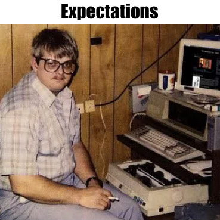
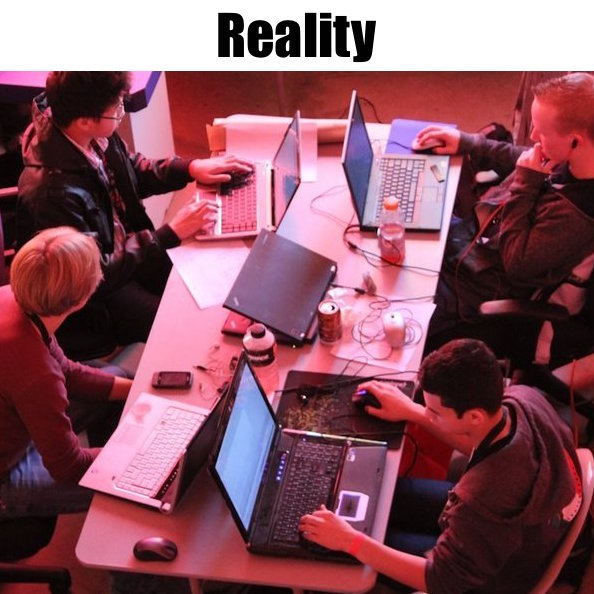

  
  

**Programming should be a very social activity.**

When I first learned how to program, I did everything on my own. I have always been a very self directed learner, and I enjoy figuring out things on my own rather than asking for help. There have been some pros and cons to this way of learning, but it seemed to fare well for me when it came to programming. I could create entire functional programs completely on my own. I could create something out of what seemed to be nothing. It was amazing. And I could do it all by myself, squinting at my screen alone in my room at 3 in the morning.

As I got further into computer science, I eventually found myself desperately wanting friends. It was a weird time in my life. It was during the middle of my undergraduate career, when I started to become feeling a little distant from old friends, and more eager to meet people who I could talk to about and share my passion with. It started off as being purely social. I decided to talk to my classmate that happened to be sitting next to me on the first day of my second Introduction to Java class. That classmate ended up being the person I spent every weekend with that semester. We had nights where we would start programming at 10 PM, stop to take a break, stretch, and then realize it was somehow already 10 AM. We bonded through the pain and suffering that came with learning data structures and sorting algorithms. Inadvertently, we became very close friends. I also made a few other friends in that class. 

Once I realized how much more sane my computer science friends made me, I decided to do something about the insanity that was being brought upon me by my discrete math class. It was hard to talk to people in class, especially in a lecture hall where there was minimal interaction between students. In order to facilitate some group support, I sent out a mass email to my classmates, suggesting a study group. I told the class that I would be at the library at a certain time to study for an upcoming exam, and I invited them all to join me. The first time I sent this email out, less than 5 people showed up. Most of these people were classmates that I had talked to in person previously. I guess nobody else was very keen on the idea of going to meet up with some person they have never met before, which is understandable. As the semester went on, our little study group slowly started to grow. Eventually, the last study group for the final exam had about 15 people. To me, this was impressive. I was so happy that this group had formed. We asked each other questions, worked on problems together, and formed new friendships. Every problem felt a little bit easier when we were all together.

### Making a Difference

Later on, one of my new computer science friends told me about an organization called Information Technology Management Association (ITMA) at the Shidler College of Business. Although it was a business club, it was open to computer science majors as well, because at this time, there was no computer science club other than the competitive hacking Grey Hats club. I decided to join in order to meet more students with the same interests as me. Later on, I joined the executive board as the Director of Marketing for the club. My major focus as director of marketing was recruitment. That semester was particularly difficult because majority of the club had graduated the previous semester, leaving the club with a measly 10 members or so. 

After some intense marketing, some food bribes, and some innocent threatening, the club orientation welcomed over 50 new members. And for the first time, this included a large group of computer science majors. Through this club, members were able to network with both each other and local professionals, make connections, get internships and jobs, and generally become more involved with the computer science community. 

I have learned that it is very important and highly beneficial to have a support group while learning computer science. It can be a very stressful and demanding field to be in. There were nights when I got one segmentation fault too many, and I began to question my sanity and my plans for the future. There were many times I began to believe I was not cut out for it, I wasn't smart enough to be a programmer, and I just wanted to give up. But, with the help of my own determination and the support of my fellow struggling classmates, I didn't give up. In the end, I accomplished many things that I once believed I never could. 

### How to Become Involved

**There are many ways to become involved with a computer science community.** At the UH Manoa ICS program, there is the newly created ICSpace lounge, which is a open area for ICS students and faculty to meet, work, and share ideas. It is also the meeting space for the UH Manoa ACM chapter, which provides ICS students with a way to bond, build applications, and expand their network. There is also the Grey Hats club for students who are interested in computer and network security. Although it is not a part of the ICS program, [ITMA](itmahawaii.com) is also a great organization for computer science members to network and expand their business skills alongside their technical knowledge. Additionally, for the entrepreneurship inclined, there is a [Hawaii Student Entrepreneurship club](http://www.hsentrepreneurs.com/) which often includes students who are searching for app developers for their startup businesses.

In the greater Hawaii, there is [TechHui](techhui.com), which brings together the general tech community using online discussion forums. TechHui members range from University students and professors to scientists, to professional developers, to tech entrepreneurs, and to casual tech lovers. There are also frequent public events throughout the year such as hackathons (i.e. AT&T Mobile App Hackathon, DevLeague Hackathons, UH Mobile App Hackathon) and software developer networking events, such as WetWare Wednesdays. Furthermore, platforms such as the real-time collaboration tool, Slack, make it easy and convenient for programmers to communicate to each other, whether they are working together on a project, are coworkers, or are classmates.

With so many opportunities available, it has become hard to not become a social programmer in some way. The old stereotype of the lone, anti-social programmer in the basement has quickly become just an outdated and irrelevant adage in the new social world of programming. 

*Image credit: osbornead.blogspot.com (left); npr.org (right)*

